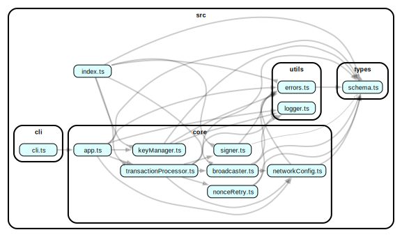

# アーキテクチャ

### レイヤードアーキテクチャ

```
┌─────────────────────────────────────────────┐
│                CLI層 (cli/)        　  　    │  プレゼンテーション層
│             UI・入出力制御                    │  commander.js
├─────────────────────────────────────────────┤
│            アプリケーション層 (core/)          │  ビジネスロジック層
│         ワークフロー制御・調整             　   │  TypeScript, viem
├─────────────────────────────────────────────┤
│              ドメイン層 (types/) 　           │  ドメインモデル層
│         ビジネスルール・データモデル     　      │  Zod, TypeScript
├─────────────────────────────────────────────┤
│           インフラストラクチャ層 (utils/)   　  │  インフラ層
│         横断的関心事・外部リソース     　  　    │  Node.js FS, Logger
└─────────────────────────────────────────────┘
```
#### 選択根拠
- **シンプルさ**: 単一ドメイン（Ethereum署名）に適した複雑度
- **保守性**: 関心事の分離により理解・変更が容易
- **テスト性**: 各層の独立テストが可能
- **過剰設計の回避**: 本プロジェクトは単一ドメイン（Ethereum署名）かつシンプルなビジネスロジックのため、クリーンアーキテクチャなどのより複雑なパターンは過剰設計と判断。開発コストと保守性のバランスが最適な層状アーキテクチャを選定しました。
- **背景**: ADR #005 で候補アーキテクチャを評価し、開発コストと保守性のバランスが最適と判断


### 主要モジュール

| モジュール | 責務 | 主要機能 |
|-----------|------|---------|
| **keyManager.ts** | 秘密鍵管理 | ファイル読み込み、権限検証、メモリクリーンアップ |
| **signer.ts** | トランザクション署名 | EIP-1559署名、アカウント生成、型変換 |
| **broadcaster.ts** | ブロードキャスト | RPC送信、エラーハンドリング、エクスプローラーURL生成 |
| **transactionProcessor.ts** | オーケストレーション | 署名→ブロードキャスト→追跡の完全ワークフロー |
| **nonceRetry.ts** | Nonce管理 | 競合解決、リトライロジック、指数関数的バックオフ |
| **networkConfig.ts** | ネットワーク設定 | チェーン設定、RPC設定、動的環境対応 |

### モジュールの依存関係


### 依存関係ルール

- **単方向の依存**: 上位層は下位層にのみ依存可能です。
  - `CLI層` → `アプリケーション層`
  - `アプリケーション層` → `ドメイン層`, `インフラストラクチャ層`
- **下位層からの独立**: `ドメイン層`と`インフラストラクチャ層`は、いかなる上位層にも依存しません。
- `dependency-cruiser` の設定により、階層違反を静的に検出・防止しています